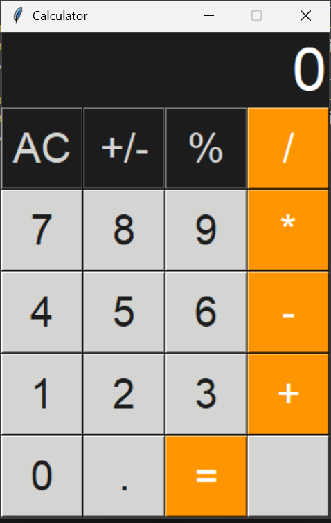

# Tkinter Calculator

A simple desktop calculator built with Python and Tkinter.

## Features

- Basic arithmetic operations (+, -, ×, ÷)
- Decimal support
- Clear (AC) button
- Positive/Negative (+/-) toggle
- Graphical User Interface (GUI) using Tkinter

## Screenshot



## Technologies Used

- Python
- Tkinter

## How to Run

1. Clone this repository.
2. Open the project folder.
3. Run:

```bash
python calculator.py
```

## What I Learned

This project helped me learn:

- Python programming
- GUI development with Tkinter
- Event-driven programming
- Git and GitHub workflow

## Author

Naftal Katangolo
